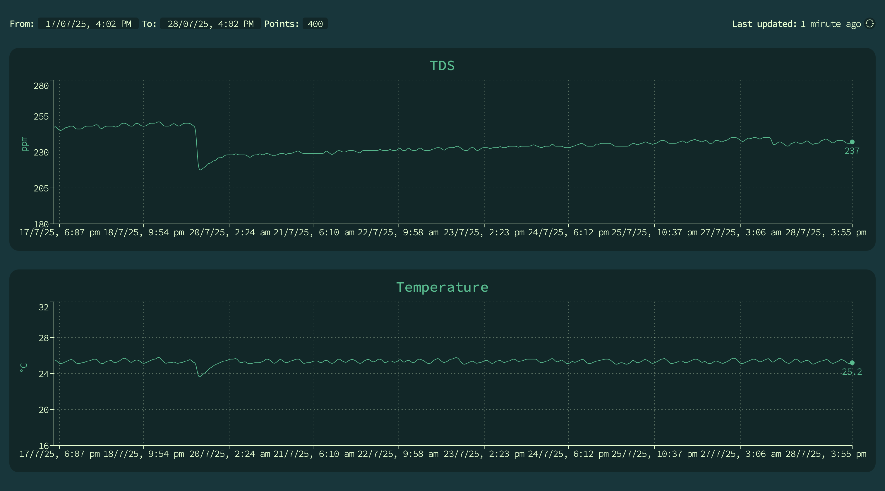

# About

This project uses an Arduino (UNO R4 WiFi), a temperature sensor (DS18B20), and a TDS sensor (Gravity: Analog TDS Sensor clone) to continuously monitor the temperature and total dissolved solids (TDS) of my aquarium.

It features a [dashboard](https://ambitious-pond-01c6b4600.1.azurestaticapps.net) for visualising trends, and automated email alerts when sensor readings exceed safety thresholds.

  

The Arduino sends sensor readings to the backend server every ~4 minutes, where they are stored in Cosmos DB, and served to the frontend on request.

  

